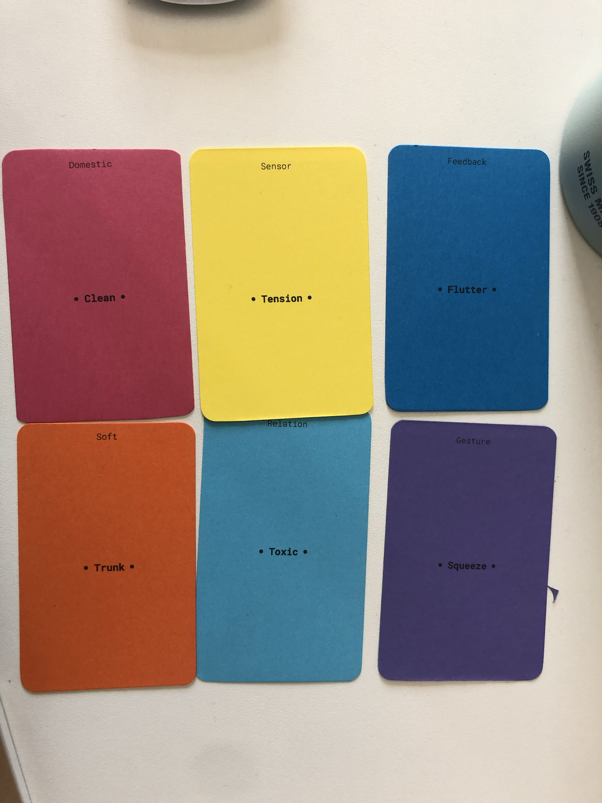
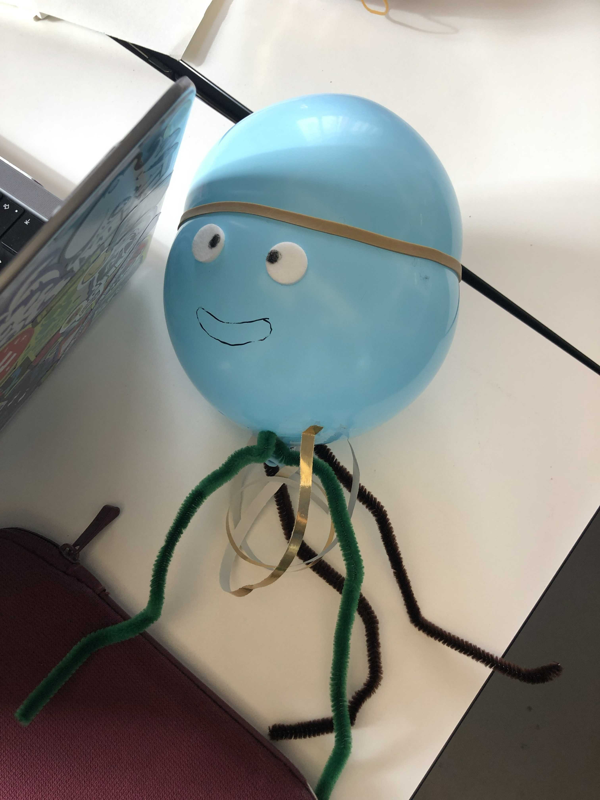
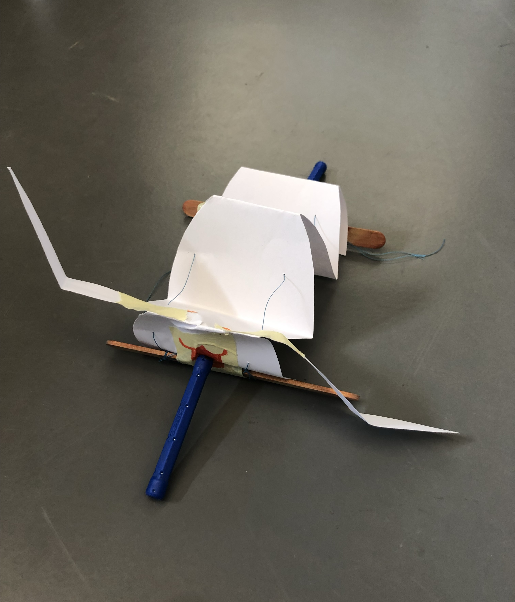
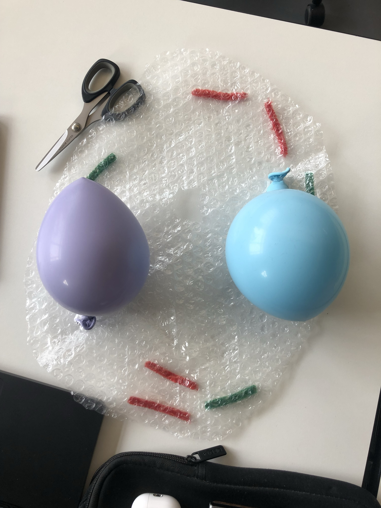

# Playing cards
Students used crash cards to quickly get the sauces flowing on exploring the vast number of concepts, references, and keywords by the team on 2024-10-14.

## Cartes performatifs
Here is a online link to the cards we used in class.

[head-md-soft-robots-cards](https://www.jeudecartesperformatif.com/cartes/1GpCnHk2lfN9w5SjtVgf-jJAkr7sh4xHUlj76pYzaXSo)

## Images
Some pictures that [Alexia Mathieu](https://www.hesge.ch/head/annuaire/alexia-mathieu) of these prototypes:

