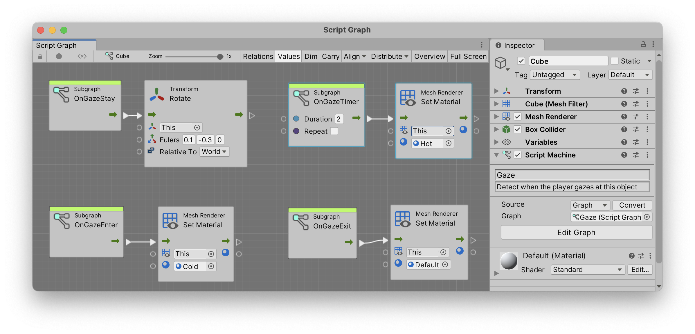
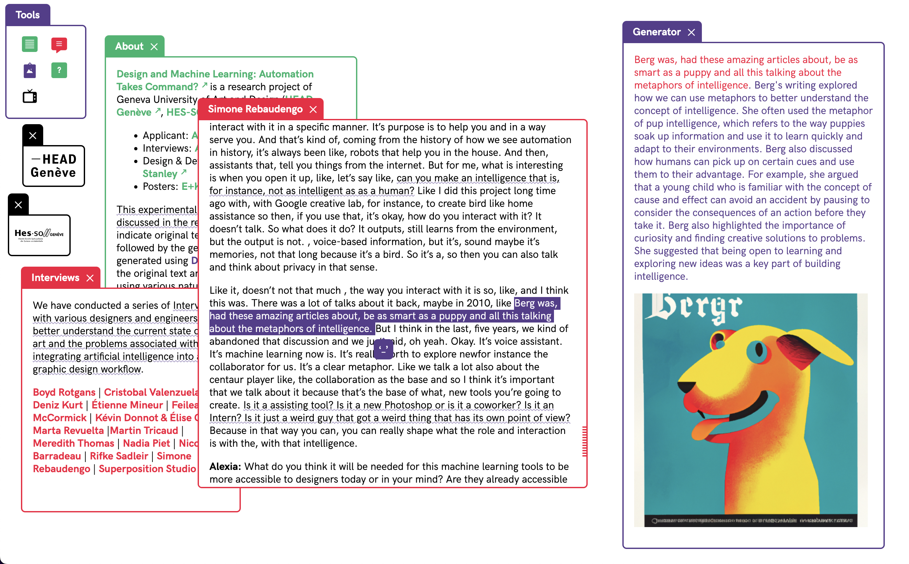

This is a mock-up of a simple note a student might make at the end of a week. Notes should be more exhaustive that this simple mock-up.

# First Week

## Prototype
Here is an screenshot from something that I created to explore _________ :

Here is another screenshot from something that I created to explore _________ :

…

## Todo
- Some goal
- Another goal
- Answer a question
- Experiment with a prototype
- …